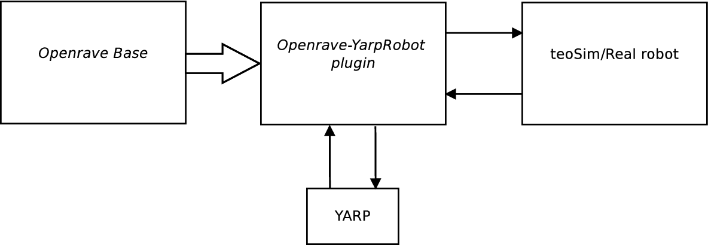

# openrave-yarp-plugins
OpenRAVE plugins to interface OpenRAVE with YARP.

The main approach is to develop OpenRAVE plugins, which internally load YARP plugins that open ports thanks to their network wrappers. Technically, the OpenRAVE plugin contains one or many `yarp::dev::PolyDriver` and calls  `open(yarp::os::Searchable &config)` passing a `yarp::os::Property` (note that `Property` is a `Searchable`) with the following contents:
- "device": A YARP plugin that is a general purpose network wrapper  (contrcontrolboardwrapper2, grabber...).
- "subdevice": A YARP plugin from this repository (implements controlboard, grabber... functionality).
- "penv": A C-style pointer to the `OpenRAVE::Environment` to be used by the "subdevice".
- Plus, whatever other information the "subdevice" YARP plugin requires (e.g. which manipulator of which robot it will control).



- **Openrave Base**: Is in charge of initializing openrave, generate the ConvexDecomposition model of the robot, and start the plugin.

- **Openrave-YarpRobot plugin**: This module is in charge of performing the collision avoidance process. It receives the commmands from YARP, and if there are no collisions, this commands are sent to the real robot. Here is where the local simulation of the system take place. 

- **teoSim/Real robot**: This module corresponds to the real robot or the teoSim Simulation.

- **YARP**: Used by the user to send the commmands to the system.

# Tutorials: (How to use the openrave-yarp-plugins for collision avoidance with teoSim)
The following commands explain how to use the openrave-yarp-plugins for collision avoidance using teoSim as the remote robot. Note that here, teoSim can be replaced for the real robot.

```bash
yarpserver
# new terminal 
teoSim
# new terminal
cd; cd repos/openrave-yarp-plugins/build/lib
python ../../examples/openrave-YarpRobot.py
# wait for the system to load the padding model
# Then the robot can be commanded via yarp with:
yarp rpc /safe/teoSim/[kinematic chain name]/rpc:i
```
